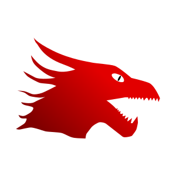

<center>

<h1>DragonHeartOS</h1>
<p>The general purpose operating system</p>
</center>
<hr>

## What is this?

The operating system is made to give you full control over your hardware from the display, audio or even serial. Currently, the operating system is in a _very_ primitive state.

## Getting started

The system can be build and ran like this:

```
$ cd Toolchain
$ ./install.sh  # This builds the toolchain for you
$ cd .. && mkdir Build && cd Build # Create Build directory
$ cmake .. -GNinja
$ ninja         # Compile!
$ ninja image   # Create disk image
$ ninja run     # Run virtual machine
```

## Goals

 - 64-bit
 - Multitasking kernel
 - Everything is easly accessible to the user, including the hardware
 - Filesystem like FAT-32
 - Shell with ability to interact with libraries (similar to pwsh). This will make the terminal as powerful to use as the GUI

## Components

 - Katline -> The kernel
 - SysInit -> Init system

### Services

 - AppBus -> Message bus
 - WinManager -> Window manager

### Libraries 

 - CommonLib -> C++ utility library
 - Marine -> The C/C++ library
 - Elf -> ELF Parser
 - Graphix -> Graphics library
 - Beyond -> The main GUI library

## License

This software is licensed under the MIT license. Learn more about it [here](LICENSE).
